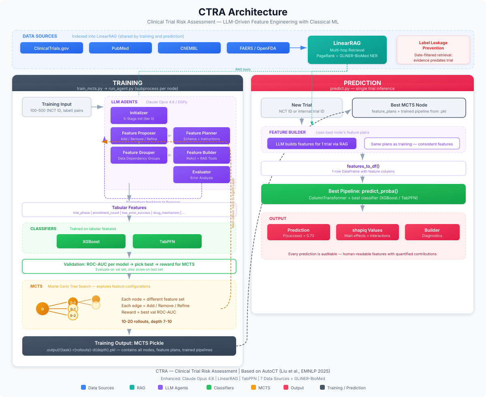
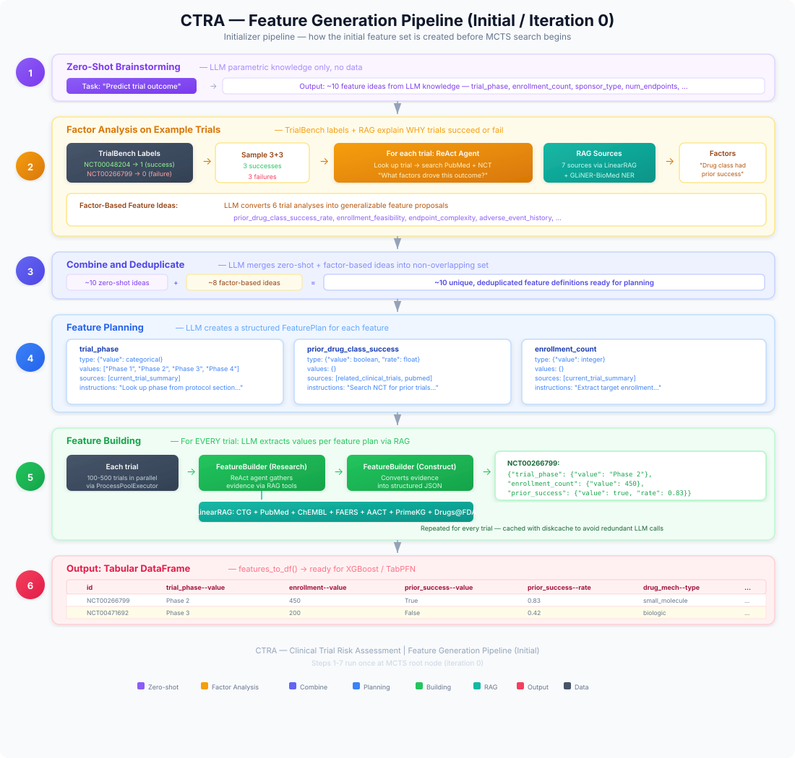
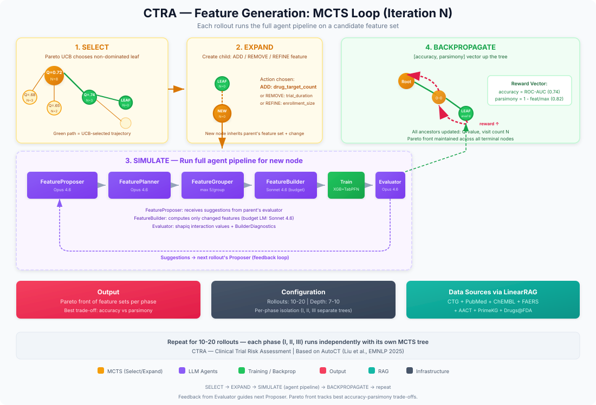
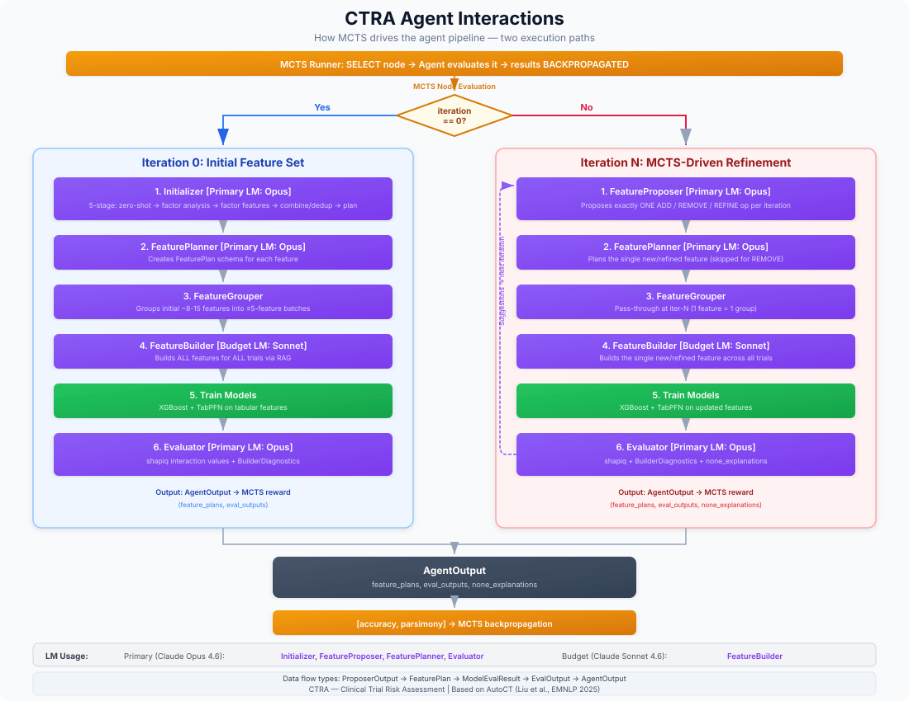
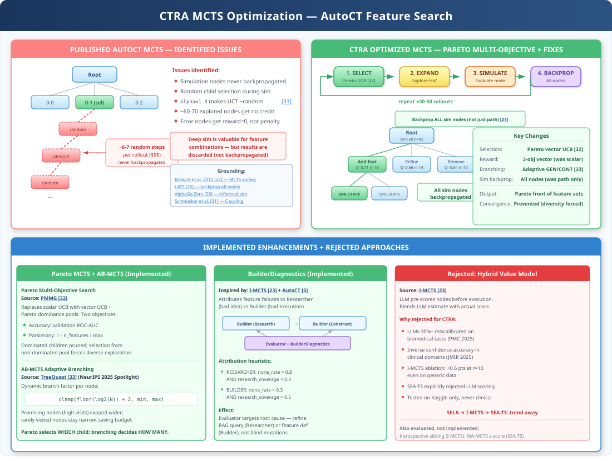

# CTRA — Clinical Trial Risk Assessment

An implementation project for clinical trial outcome prediction (success/failure), built on published state-of-the-art research. The primary approach is AutoCT — LLM agents that autonomously engineer interpretable tabular features, evaluated with classical ML (XGBoost, TabPFN) and explained via SHAP. The LLM backbone will be GLM 5.2 (z.ai) with LinearRAG for multi-hop retrieval across 7 data sources: ClinicalTrials.gov, PubMed, ChEMBL, FAERS, AACT, PrimeKG, and Drugs@FDA. Named entity recognition uses GLiNER-BioMed [[34]](#ref-34) for zero-shot biomedical NER with 16 entity types. Other published models (HINT, MEXA-CTP, LIFTED, CLaDMoP) serve as research context and validation baselines.

---

## Table of Contents

1. [Problem Statement](#problem-statement)
2. [Architecture Overview](#architecture-overview)
3. [Workflow](#workflow)
4. [State of the Art](#state-of-the-art)
   - 4.1 [AutoCT — Primary Approach](#autoct--primary-approach)
   - 4.2 [HINT — The Baseline](#hint--the-baseline)
   - 4.3 [MEXA-CTP — TOP Benchmark SOTA](#mexa-ctp--top-benchmark-sota)
   - 4.4 [LIFTED — LLM-Based Multimodal Fusion](#lifted--llm-based-multimodal-fusion)
   - 4.5 [CLaDMoP — Cross-Disease Generalization](#cladmop--cross-disease-generalization)
5. [Research Approaches Comparison](#research-approaches-comparison)
6. [Benchmarks and Datasets](#benchmarks-and-datasets)
7. [Input Modalities](#input-modalities)
8. [Reference Implementations](#reference-implementations)
9. [Supporting Research](#supporting-research)
10. [References](#references)
11. [Abbreviations](#abbreviations)
12. [Related Notes](#related-notes)

---

## Problem Statement

Clinical trials fail at alarming rates. Only **10-15% of drugs** entering Phase I reach approval. The highest attrition occurs at the Phase II → III transition (~65-70% fail). Each failed Phase III trial costs **$50M-$300M+** and years of development time.

Recent research has demonstrated that trial outcomes (success/failure) can be predicted from publicly available data — drug molecular structure, disease codes, eligibility criteria text, and trial metadata — with meaningful accuracy. The key published results:

| Model | Phase I F1 | Phase II F1 | Phase III F1 | Phase III PR-AUC | Benchmark |
|-------|-----------|------------|-------------|-----------------|-----------|
| **AutoCT [[5]](#ref-5) (2025)\*** | **0.595** | **0.386** | **0.760** | **0.697** | **TrialBench** |
| HINT [[10]](#ref-10) (2022 baseline) | 0.665 | 0.620 | 0.847 | 0.811 | TOP |
| MEXA-CTP [[1]](#ref-1) (2025) | 0.713 | 0.695 | 0.857 | 0.771 | TOP |
| CLaDMoP [[3]](#ref-3) (2025) | 0.713 | 0.685 | 0.861 | 0.860 | TOP |
| LIFTED [[2]](#ref-2) (2025) | 0.716 | 0.662 | 0.838 | 0.883 | TOP |

\*AutoCT is evaluated on TrialBench (not TOP) — results are not directly comparable to the TOP benchmark models above. Additional metrics: ROC-AUC 0.753 / 0.639 / 0.702 and PR-AUC 0.710 / 0.512 / 0.697 for Phase I / II / III. Highest Phase I PR-AUC (0.710) on TrialBench. Full shapiq interaction-level interpretability via classical ML (XGBoost, TabPFN).

**CTRA focuses on AutoCT** for its combination of interpretability, low infrastructure complexity, and competitive accuracy. Key enhancements over the published approach: LLM backbone upgrade from gpt-4o-mini to **GLM 5.2** (z.ai), **LinearRAG** for multi-hop retrieval (replacing pgvector/txtai), **TabPFN** as an additional classifier (100% win rate vs XGBoost on small datasets), and expanded data sources (**ChEMBL** for drug/target data, **FAERS/OpenFDA** for safety signals, **AACT** for population-level statistics, **PrimeKG** for biological knowledge, **Drugs@FDA** for approval history). The deep learning models above serve as performance baselines on the TOP benchmark.

These are not theoretical — the code is published, the benchmarks are reproducible, and the models run on standard hardware. **The gap is implementation, not research.**

---

## Architecture Overview









### MCTS Optimization



> **Detailed research:** [research/mcts-alternatives-and-improvements.md](./research/mcts-alternatives-and-improvements.md) — full comparison of MCTS alternatives (AB-MCTS, PMMG, LLM-FE, AIDE, Fleet of Agents), deep analysis of Pareto MCTS for feature engineering, and implementation roadmap.

CTRA's MCTS strategy combines three layers: (1) fixes to the published AutoCT implementation, (2) Pareto multi-objective search adapted from PMMG [[32]](#ref-32), and (3) adaptive branching from AB-MCTS [[33]](#ref-33). The core insight: **feature engineering for clinical trials has the same structural properties as molecular generation — individual features are meaningless, only combinations have value, and the search space is deceptive** (see [deep analysis](./research/mcts-alternatives-and-improvements.md#deep-analysis-pareto-mcts-for-feature-engineering-pmmg--autoct)).

#### Pareto Multi-Objective MCTS (from PMMG)

The most significant change from published AutoCT. AutoCT optimizes a single scalar (ROC-AUC), which causes premature convergence to one exploitation path. PMMG [[32]](#ref-32) demonstrates that replacing scalar UCB with **vector UCB + Pareto dominance pools** achieves 2.5x improvement on multi-objective molecular optimization.

**Adaptation for CTRA:** With per-phase pipeline isolation, each phase's MCTS tree optimizes two objectives via Pareto-filtered vector UCB:

| Objective | Metric | Why it matters |
|-----------|--------|----------------|
| Accuracy | Validation ROC-AUC | Primary predictive performance for this phase |
| Parsimony | 1 − n_features / max_features | Lower LLM cost, less overfitting, better interpretability |

The hypervolume reference point — the corner from which each feature set's dominated volume is measured when the final node is selected — is `[0.5, 0.0]`: accuracy at the ROC-AUC chance baseline, parsimony at its floor. The 0.5 of ROC-AUC that every classifier gets for free is not credited as accuracy; measuring from the origin instead let a one-feature root outrank a deep feature set under accuracy noise, because the root's only advantage was that free width. The reference is used by the final selection (hypervolume contributions over the front of own evaluations), by the best-on-path pick inside each deep simulation, and by the `(hypervolume, accuracy)` key that ranks a node's own evaluations. In-search child selection (`pareto_select` over UCB vectors, which are not AUCs) and the MLflow `rollout_hypervolume` metric still measure from the origin; moving them is deferred.

At each MCTS node, vector UCB scores are computed for all children. Dominated children (worse on ALL objectives) are pruned. Selection randomly picks from the non-dominated (Pareto-optimal) pool — this forces diverse exploration across the trade-off surface and prevents convergence to a single feature philosophy. Each phase runs independently, so Phase I, II, and III can discover different feature sets optimized for their specific success drivers.

**Output:** A Pareto front of feature sets per phase — an interpretable 5-feature set for clinical dashboards, a 15-feature set for high-stakes predictions. Decision-makers choose from the trade-off surface rather than receiving a single opaque "best" model.

**Grounding:** PMMG achieves 51.65% success rate vs 12.7% best baseline on 7-objective optimization. Quality-Diversity algorithms using similar stepping-stone mechanisms outperform single-objective methods by orders of magnitude on deceptive landscapes (p<10^-9). See [deep analysis](./research/mcts-alternatives-and-improvements.md#deep-analysis-pareto-mcts-for-feature-engineering-pmmg--autoct) for the full theoretical case.

#### AB-MCTS Adaptive Branching (from TreeQuest)

AB-MCTS [[33]](#ref-33) (NeurIPS 2025 Spotlight) replaces fixed branching with a dynamic decision at each node: **go wider** (generate new feature proposals) or **go deeper** (refine existing promising feature sets). Uses logarithmic scaling of branch factor with visit count — `floor(log2(visit_count)) + 2` clamped to [min, max] — so frequently visited nodes expand wider while rarely visited nodes stay narrow. Complementary to Pareto MCTS: adaptive branching decides *how* to expand; Pareto selection decides *which* child to visit.

#### Fixes to Published AutoCT MCTS

Code analysis of AutoCT's MCTS identified implementation issues (simulation nodes not backpropagated, low rollout counts). CTRA applies two fixes: full simulation-path backpropagation and increased rollouts (30-50). Additional evaluated improvements remain as future enhancements. See [Fixes to Published AutoCT MCTS](./research/mcts-alternatives-and-improvements.md#fixes-to-published-autoct-mcts) for the full table with rationale, grounding, and implementation status.

### Per-Phase Pipeline Isolation

Following AutoCT's architecture, CTRA runs **completely isolated pipelines per clinical trial phase**. Each phase (I, II, III) gets its own MCTS tree, feature engineering, trained models, and output artifacts. This reflects the fundamental difference in what drives success across phases — Phase I trials (safety) have different predictive features than Phase II (efficacy signal) or Phase III (confirmatory evidence).

---

## Workflow

The end-to-end pipeline has five stages: data preparation, RAG indexing, MCTS training, prediction, and API serving.

### 1. Data Preparation

Download and prepare Parquet files for each of the 7 data sources. The data loaders in `src/ctra/data/` handle fetching and normalization:

| Source | Loader | Notes |
|--------|--------|-------|
| ClinicalTrials.gov | `ctg_loader.py` / `ctg_api.py` | Protocol sections via API or AACT dump |
| PubMed | `pubmed_loader.py` | Abstracts + MeSH terms via Entrez API |
| ChEMBL | `chembl_loader.py` | Drug mechanisms, targets, clinical phase progression |
| FAERS/OpenFDA | `faers_loader.py` | Post-market adverse event reports |
| AACT | `aact_loader.py` | Full ClinicalTrials.gov relational database |
| PrimeKG | `primekg_loader.py` | Biological knowledge graph (Harvard Dataverse) |
| Drugs@FDA | `drugsfda_loader.py` | FDA approval history via openFDA API |

Benchmark task splits (train/val/test) for each phase are stored as Parquet files under `tasks/trial_approval/phase{1,2,3}_{train,val,test}_data.parquet`.

### 2. RAG Indexing

Build the LinearRAG index from prepared data. This converts structured records into natural-language passages, runs GLiNER-BioMed NER for entity extraction, and builds the entity co-occurrence graph for multi-hop retrieval via Personalized PageRank.

```bash
# Build full index from all 7 sources
python scripts/build_rag_index.py build

# Build from specific sources only
python scripts/build_rag_index.py build --sources ctg,pubmed,chembl

# Build a single source from a custom parquet file
python scripts/build_rag_index.py build-ctg --input datasets/ctg_studies.parquet

# Custom output directory
python scripts/build_rag_index.py build --output datasets/my-index
```

The index is written to `datasets/linearrag-index/` by default. `resultsSection` data from ClinicalTrials.gov is never indexed (leakage prevention).

### 3. MCTS Training (Per-Phase)

Each clinical trial phase runs an independent MCTS search — separate feature engineering, separate model, separate output directory.

```bash
# Train Phase 2 model with 20 rollouts, depth 10
python scripts/train_mcts.py --task phase2 --rollouts 20 --depth 10

# Train all three phases
python scripts/train_mcts.py --task phase1 --rollouts 20
python scripts/train_mcts.py --task phase2 --rollouts 20
python scripts/train_mcts.py --task phase3 --rollouts 20

# Resume from checkpoint
python scripts/train_mcts.py --task phase2 --resume .output/phase2/checkpoint.pkl
```

### Outputs and caches

The MCTS training pipeline produces two separate output trees (one for training, one for feature storage), both covered by `.gitignore`:

**Training artifacts** (`.output/<phase>/`):
- `feature_plans.json` — the feature plans of the selected best node (one feature set, not the whole Pareto front; the front lives in `mcts_state.pkl`)
- `best_model.pkl` — the fitted model pipeline (XGBoost or TabPFN) of the best node's best evaluation
- `results.json` — run summary: task, rollouts, depth, backprop rule, best feature set with its own objective vector (`best_objectives`) and value estimate (`best_mean_objectives`), node count, elapsed time
- `mcts_state.pkl` — the pickled `MCTSSearch` (the full tree; each node keeps its `objective_history`) plus the last rollout index and the CLI args, in the same `{"mcts", "rollout", "args"}` format as `checkpoint.pkl`
- `checkpoint.pkl` — intermediate checkpoint for resuming long runs (see `--resume` above)
- `agent_cache/<run_id>/` — pickled `AgentOutput` per evaluated node (`<phase>--<node_id>.output.pkl`: feature plans, evaluation results, trained model pipelines and the train/val frames) — crash-recovery cache for this run; loaded with `dill`, so the same trust boundary as the feature store applies

**Feature cache** (`output/feature_store/<phase>/<feature_name>--<plan_hash>/`):
- `<nctid>.json` — cached computed feature values for a trial, scoped by phase and plan content

The two caches are per-phase for different reasons. The feature store is namespaced by `Task.output_subdir` (the orchestrator passes it as the store's `task_namespace`) so that phase-specific task descriptions never collide; the store is loaded with `dill.loads`, which `feature_store.py` documents as a trust boundary. The agent cache is per-phase only because `train_mcts.py` nests it under `<output_dir>/<phase>/agent_cache/<run_id>/`; its entries are keyed by a run-stable node id that does not encode the run itself, so a second fresh run over the same `--output-dir` would replay the first run's pickles unless each run gets its own directory.

Fallback location (`output/agent_cache/`, i.e. `settings.output_dir / "agent_cache"`): used only when `run_agent_as_subprocess` is called without a `cache_dir` — for example when it is passed bare as the `runner` of an `MCTSSearch` constructed programmatically (`MCTSSearch` has no default runner; the caller supplies one). `train_mcts.py` never uses it; it always passes the per-run directory above. Keys are still phase-prefixed (`phase2--<node_id>.output.pkl`), so phases cannot collide there.

**Measured reuse:** _pending — see issue #17._

### 4. Prediction

Predict the outcome of a single clinical trial using a trained phase-specific model.

```bash
# Predict using Phase 2 model
python scripts/predict.py --model-dir .output/phase2/ --nctid NCT00110279

# JSON output
python scripts/predict.py --model-dir .output/phase2/ --nctid NCT00110279 --format json
```

### 5. API Serving

Start the FastAPI prediction service and query it with an optional phase parameter.

```bash
# Start the API server
uvicorn ctra.api.app:app --host 0.0.0.0 --port 8000

# Predict via API (phase-specific)
curl -X POST http://localhost:8000/api/v1/predict \
  -H "Content-Type: application/json" \
  -d '{"trial_id": "NCT00110279", "phase": 2}'

# Batch prediction
curl -X POST http://localhost:8000/api/v1/predict/batch \
  -H "Content-Type: application/json" \
  -d '{"trial_ids": ["NCT00110279", "NCT00048204"], "phase": 2}'
```

---

## State of the Art

### AutoCT — Primary Approach

**Paper:** Liu et al. [[5]](#ref-5), EMNLP 2025
**Repository:** [github.com/linyongver/AutoCT](https://github.com/linyongver/AutoCT)

**This is CTRA's primary implementation direction.** A fundamentally different approach from deep learning — LLM agents autonomously engineer tabular features, then train classical ML models with full SHAP interpretability.

**Architecture:**
- **Feature proposal:** DSPy ReAct agents propose features using chain-of-thought reasoning over task descriptions and labeled examples
- **Feature planning:** LLM generates structured feature schemas (type, data sources, extraction instructions) for each proposed feature
- **Feature building:** ReAct agents with tool-augmented reasoning extract feature values per trial via RAG over 7 data sources (LinearRAG with multi-hop retrieval via Personalized PageRank over an entity co-occurrence graph). Entity extraction uses GLiNER-BioMed [[34]](#ref-34) with 16 zero-shot entity types (Drug, Disease, Gene or protein, Mechanism of action, Clinical endpoint, Adverse event, etc.)
- **Feature refinement:** Monte Carlo Tree Search (MCTS) iteratively evaluates and refines feature sets — each node is a different feature configuration, with Add/Remove/Refine operations guided by LLM evaluation of misclassified trials. CTRA extends the published MCTS with Pareto multi-objective search (adapted from PMMG [[32]](#ref-32)), AB-MCTS adaptive branching [[33]](#ref-33), and fixes from I-MCTS [[23]](#ref-23) / SEA-TS [[24]](#ref-24) analysis — see [MCTS Optimization](#mcts-optimization) and [detailed research notes](./research/mcts-alternatives-and-improvements.md)
- **Prediction:** Two ML models — **XGBoost** and **TabPFN** — trained on agent-generated tabular features. TabPFN is a pre-trained tabular foundation model (Nature 2025) with 100% win rate vs XGBoost on datasets ≤10K rows
- **Interpretability:** shapiq interaction values (k-SII for XGBoost, FSII for TabPFN) quantify both main effects and pairwise feature interactions — every prediction is auditable on human-readable features. BuilderDiagnostics attribute failures to Researcher (bad feature idea) vs Builder (bad execution) for targeted MCTS feedback
- **Label leakage prevention:** Date-filtered retrieval ensures all evidence predates the trial's start date

**LLM backbone:** Currently gpt-4o-mini. CTRA upgrades to **GLM 5.2** (via the z.ai API) for stronger reasoning, better feature extraction, and more reliable structured output.

**RAG backend:** The published implementation uses pgvector + txtai (PubMedBERT embeddings) with single-hop semantic search over PubMed and ClinicalTrials.gov. CTRA replaces this with **LinearRAG** [[22]](#ref-22) for multi-hop retrieval via Personalized PageRank over an entity co-occurrence graph. Zero LLM cost during indexing. Entity extraction uses **GLiNER-BioMed** [[34]](#ref-34) — a zero-shot biomedical NER model that extracts 16 entity types (Drug, Disease, Gene or protein, Mechanism of action, Clinical endpoint, Adverse event, Biomarker, etc.) specified at runtime. Drug synonym expansion at query time uses ChEMBL synonym tables to bridge brand/generic/research-code name fragmentation (e.g., "Keytruda" → seeds PPR from both the "Keytruda" and "Pembrolizumab" graph nodes).

**Data sources:** Published AutoCT uses only ClinicalTrials.gov and PubMed. CTRA expands to 7 sources (all free and publicly available):
- **ClinicalTrials.gov** — trial protocols via API or AACT relational dump
- **PubMed** — biomedical literature abstracts + MeSH terms
- **ChEMBL** — drug mechanisms of action, targets, clinical phase progression, ATC classification (replaces DrugBank, which requires a paid license; ChEMBL covers both small molecules and biologics)
- **FAERS/OpenFDA** — post-market adverse event reports, safety signals
- **AACT** — full ClinicalTrials.gov relational database for population-level features (sponsor track records, disease success rates)
- **PrimeKG** — biological knowledge graph with 4M+ relationships across drugs, targets, pathways, diseases, phenotypes (Harvard Dataverse, MIT license)
- **Drugs@FDA** — FDA approval history since 1939 via openFDA API (approval dates, review priority, sponsor track records)

**Key results (TrialBench):** ROC-AUC 0.753 / 0.639 / 0.702 for Phase I / II / III. Highest Phase I PR-AUC (0.710). Competitive with deep learning SOTA while being fully interpretable. Supports 8 task types: trial approval (all phases), serious adverse events, patient dropout, and mortality prediction.

**Why it matters for CTRA:** AutoCT provides competitive accuracy with full transparency — every feature is human-readable and every prediction is explainable via SHAP. The agent framework is extensible to new data sources by adding RAG tool functions. Unlike deep learning approaches, it requires no SMILES encoding (can handle biologics and non-small-molecule interventions) and no specialized knowledge graphs. CTRA evaluates only XGBoost and TabPFN — TabPFN is expected to further improve accuracy on small training sets without sacrificing interpretability.

---

### HINT — The Baseline

**Paper:** Fu et al. [[10]](#ref-10), Patterns (Cell Press) 2022
**Repository:** [github.com/futianfan/clinical-trial-outcome-prediction](https://github.com/futianfan/clinical-trial-outcome-prediction)

The foundational model that established the TOP (Trial Outcome Prediction) benchmark used by all subsequent work.

**Architecture:**
- **Drug modality:** MPNN (Message Passing Neural Network) encodes SMILES molecular graphs
- **Disease modality:** GRAM ontology graph encodes ICD-10 disease codes with ancestor relationships
- **Eligibility criteria:** ClinicalBERT encodes criteria text at paragraph level
- **Fusion:** Hierarchical attention GCN combines all three modalities
- **Output:** Binary success/failure per phase (separate models for Phase I, II, III)

**Limitations that subsequent papers address:**
- Requires ADMET pharmacokinetic data (not always available at prediction time)
- Paragraph-level criteria encoding collapses inclusion/exclusion distinction
- Hard-coded interaction graph encodes human assumptions
- Only handles small-molecule interventional trials

---

### MEXA-CTP — TOP Benchmark SOTA

**Paper:** Zhang et al. [[1]](#ref-1), SDM 2025
**Repository:** [github.com/YuanzhiQiu/MEXA-CTP](https://github.com/YuanzhiQiu/MEXA-CTP)

Current state-of-the-art on the TOP benchmark with a lightweight architecture.

**Architecture:**
- **Drug:** DeepChem molecular fingerprints (no ADMET needed)
- **Disease:** icdcodex ICD-10 embeddings (no external knowledge graph needed)
- **Eligibility:** BioBERT **statement-level** embeddings — each inclusion/exclusion criterion encoded separately via a Siamese transformer
- **Fusion:** Three pairwise "Mode Expert" cross-attention modules (drug↔disease, drug↔criteria, disease↔criteria) with NT-Xent contrastive loss
- **Token selection:** Cauchy-penalized selection identifies which criteria statements matter most — random selection collapses F1 from 0.857 to 0.328

**Key results:** +11.3% F1, +12.2% PR-AUC, +2.5% ROC-AUC over HINT (average across all phases).

**Why it matters for CTRA:** Serves as the TOP benchmark SOTA validation baseline. Lightweight, no expensive data dependencies (ADMET, knowledge graphs), and the token selection mechanism provides interpretability — you can see which eligibility criteria drive the prediction.

---

### LIFTED — LLM-Based Multimodal Fusion

**Paper:** Zheng et al. [[2]](#ref-2), Findings of EMNLP 2025
**Repository:** [github.com/sherry6247/LIFTED](https://github.com/sherry6247/LIFTED)

Unifies all modalities into natural language via LLM prompting, then uses Sparse Mixture-of-Experts (SMoE) for fusion.

**Architecture:**
- **Key insight:** Convert all modalities to text descriptions using LLM prompts, then encode with transformer encoders
- **Drug:** LLM generates textual descriptions of molecular properties from SMILES
- **Disease:** LLM generates disease descriptions from ICD codes
- **Criteria:** Direct text encoding
- **Fusion:** SMoE framework — pool of expert networks, each modality routed to top-k experts via learned gating
- **Dynamic weighting:** Model learns to up-weight eligibility criteria for Phase I (enrollment feasibility matters) and drug information for Phase III (efficacy signal matters)

**Key results:** Best performance across all phases on both TOP and CTOD benchmarks. Outperforms fixed weighting by 18.1% PR-AUC in Phase II.

**Why it matters for CTRA:** Reference for maximum deep learning accuracy. The LLM-as-unifier approach is elegant and extensible — new modalities (e.g., protocol metadata) can be added by writing a new prompt template, not redesigning the architecture.

---

### CLaDMoP — Cross-Disease Generalization

**Paper:** Zhang et al. [[3]](#ref-3), KDD 2025

CLIP-inspired two-branch architecture designed for generalization to unseen diseases.

**Architecture:**
- **Branch 1 (Criteria):** Frozen BioGPT encoder for eligibility criteria text
- **Branch 2 (Drug-Disease):** Lightweight encoder for drug fingerprints + ICD-10 embeddings
- **Pre-training:** Self-supervised pair matching on the SCT (Successful Clinical Trials) dataset — learns to associate drugs, diseases, and criteria patterns
- **Fine-tuning:** LoRA (rank=8) on all attention layers for efficient adaptation
- **Multi-level fusion:** Grouping blocks align representations across branches

**Key results:** +10.5% PR-AUC and +3.6% ROC-AUC over MEXA-CTP. Strong generalization to diseases not seen during training.

**Why it matters for CTRA:** The cross-disease generalization is critical for real-world deployment where trials cover diverse therapeutic areas. LoRA fine-tuning means adaptation is practical with limited compute.

---

## Research Approaches Comparison

| Dimension | HINT [[10]](#ref-10) | MEXA-CTP [[1]](#ref-1) | LIFTED [[2]](#ref-2) | CLaDMoP [[3]](#ref-3) | AutoCT [[5]](#ref-5) |
|-----------|------|----------|--------|---------|--------|
| **Year** | 2022 | 2025 | 2025 | 2025 | 2025 |
| **Drug encoding** | MPNN on molecular graph | DeepChem fingerprints | LLM text description | DeepChem fingerprints | LLM-generated features |
| **Disease encoding** | GRAM ontology graph | icdcodex embeddings | LLM text description | icdcodex embeddings | LLM-generated features |
| **Criteria encoding** | ClinicalBERT (paragraph) | BioBERT (statement-level) | Transformer (text) | BioGPT (frozen) | LLM-generated features |
| **Fusion** | Hierarchical attention GCN | Pairwise cross-attention | Sparse MoE | CLIP-style pair matching | Not needed (tabular) |
| **ADMET required** | Yes | No | No | No | No |
| **Interpretability** | Low | Medium (token selection) | Low | Low | High (SHAP) |
| **Generalization** | Single-disease | Single-disease | Multi-dataset | Cross-disease | Data-driven |
| **Complexity** | High | Medium | High | Medium | Low (classical ML) |

**Implementation approach:**
1. **AutoCT** (PRIMARY) — interpretable, low complexity, competitive accuracy; enhanced with GLM 5.2, LinearRAG, XGBoost + TabPFN, Pareto MCTS, ChEMBL + FAERS + AACT + PrimeKG + Drugs@FDA data sources
2. **HINT** — reproduce as baseline for TOP benchmark comparison
3. **MEXA-CTP** — TOP benchmark SOTA, validation baseline
4. **LIFTED** — reference for maximum deep learning accuracy

---

## Benchmarks and Datasets

| Dataset | Source | Size | Task | Used By |
|---------|--------|------|------|---------|
| **TOP** | ClinicalTrials.gov + DrugBank + IQVIA | 17,538 trials | Binary success/failure per phase | HINT, MEXA-CTP, CLaDMoP, LIFTED |
| **CTOD** | ClinicalTrials.gov | 12,477 trials | Binary success/failure | LIFTED |
| **TrialBench** [[20]](#ref-20) | ClinicalTrials.gov + DrugBank + TrialTrove | 23 datasets, 8 tasks | Multi-task prediction | AutoCT |
| **SCT** | ClinicalTrials.gov + DrugBank | 4,289 drugs, 3,326 diseases | Self-supervised pre-training | CLaDMoP |

### TOP (Trial Outcome Prediction)

The standard benchmark, created by Fu et al. [[10]](#ref-10) with the HINT model. Contains 17,538 clinical trials covering 13,880 small-molecule drugs and 5,335 diseases sourced from ClinicalTrials.gov and DrugBank. Labels were manually curated by IQVIA. Temporal split: train/validation completed before Jan 1, 2014; test started after Jan 1, 2014. Phase breakdown: 1,787 Phase I (70% success rate), 6,102 Phase II (33% success), 4,576 Phase III (30% success). Three modalities: SMILES molecular structures, ICD-10 disease codes, and eligibility criteria free text. Included in the HINT repository (`repositories/clinical-trial-outcome-prediction/`).

### CTOD (Clinical Trial Outcome Dataset)

Alternative benchmark used by LIFTED [[2]](#ref-2) alongside TOP. Contains 12,477 trial records with the same modalities as TOP but different label sources. Phase breakdown: 1,788 Phase I, 6,104 Phase II, 4,578 Phase III. Used to validate cross-dataset generalization — LIFTED reports results on both TOP and CTOD.

### TrialBench

Comprehensive multi-task benchmark released by Chen et al. [[20]](#ref-20) (2025). Provides 23 AI-ready datasets covering 8 prediction tasks: trial duration, patient dropout (event + rate), serious adverse events, mortality, trial approval, failure reason identification, eligibility criteria design, and drug dose finding. Spans 143,800+ trials with 5 input modalities (SMILES, ICD-10 codes, eligibility text, MeSH terms, tabular features). AutoCT [[5]](#ref-5) uses the Trial Approval Prediction task (43,202 trials). The failure reason identification task (41,369 trials, 4 categories) is relevant to CTRA's Phase 4 enhancements. Available via Python/R package `trialbench`.

### SCT (Successful Clinical Trials)

Pre-training dataset created by the CLaDMoP [[3]](#ref-3) authors. Contains drug-disease-criteria triplets from trials whose drugs reached market approval (assumed to have passed all phases). 4,289 drugs, 3,326 diseases, 2,902 unique drug combinations. Constructed by linking ClinicalTrials.gov with DrugBank drug synonyms. Temporal filtering prevents data leakage with the TOP test set. Used exclusively for CLaDMoP's self-supervised contrastive pre-training stage.

The TOP benchmark is the standard. It is included in the HINT repository ([github.com/futianfan/clinical-trial-outcome-prediction](https://github.com/futianfan/clinical-trial-outcome-prediction)).

---

## Input Modalities

AutoCT takes a fundamentally different approach to input modalities. Rather than pre-encoding drug, disease, and criteria into fixed representations, LLM agents dynamically construct features from raw trial data and external literature via RAG. This means AutoCT is not restricted to small-molecule drugs with SMILES — it can potentially handle biologics, devices, and behavioral interventions through text-based feature construction.

For the deep learning baseline models, the standard three modalities apply:

### Drug Information
- **Source:** ClinicalTrials.gov intervention fields → DrugBank for SMILES strings
- **Encoding options:** MPNN molecular graphs (HINT), DeepChem fingerprints (MEXA-CTP, CLaDMoP), LLM text descriptions (LIFTED)
- **Limitation:** Only works for small-molecule drugs with known SMILES. Biologics, devices, and behavioral interventions require different approaches

### Disease Information
- **Source:** ClinicalTrials.gov condition fields → MeSH/ICD-10 codes
- **Encoding options:** GRAM ontology graph (HINT), icdcodex embeddings (MEXA-CTP, CLaDMoP), LLM text descriptions (LIFTED)

### Eligibility Criteria
- **Source:** ClinicalTrials.gov eligibility criteria free text
- **Encoding options:** Paragraph-level ClinicalBERT (HINT), statement-level BioBERT with Siamese transformer (MEXA-CTP), BioGPT (CLaDMoP), LLM feature extraction (AutoCT)
- **Key finding:** Statement-level encoding with inclusion/exclusion separation dramatically outperforms paragraph-level (MEXA-CTP F1 drops from 0.857 to 0.328 with random token selection)

---

## Reference Implementations

Reference implementations are not vendored in this repository (no `repositories/` directory is tracked); see their original GitHub repos linked in the table below. The TrialBench benchmark dataset [[20]](#ref-20) (23 datasets, 8 tasks; source of AutoCT training/evaluation splits) is not checked in either — it is available via the `trialbench` package, see [TrialBench](#trialbench) above.

**External reference repositories** (not included in this repo):

| Paper | Ref | Source | Role in CTRA |
|-------|-----|--------|-------------|
| AutoCT — Interpretable LLM Agents | [[5]](#ref-5) | [github.com/linyongver/AutoCT](https://github.com/linyongver/AutoCT) | **Primary model** — LLM agent feature engineering + classical ML (XGBoost, TabPFN) with SHAP |
| HINT — Hierarchical Interaction Network | [[10]](#ref-10) | [github.com/futianfan/clinical-trial-outcome-prediction](https://github.com/futianfan/clinical-trial-outcome-prediction) | **Baseline** — includes TOP benchmark dataset |
| MEXA-CTP — Mode Experts Cross-Attention | [[1]](#ref-1) | [github.com/YuanzhiQiu/MEXA-CTP](https://github.com/YuanzhiQiu/MEXA-CTP) | **Validation baseline** — TOP benchmark SOTA |
| LIFTED — LLM-Based Multimodal Fusion | [[2]](#ref-2) | [github.com/sherry6247/LIFTED](https://github.com/sherry6247/LIFTED) | **Reference** — deep learning accuracy ceiling |
| LinearRAG — Efficient Graph RAG | [[22]](#ref-22) | [github.com/DEEP-PolyU/LinearRAG](https://github.com/DEEP-PolyU/LinearRAG) | **RAG pipeline** — multi-hop retrieval via Personalized PageRank |
| GLiNER-BioMed — Biomedical NER | [[34]](#ref-34) | [github.com/ds4dh/GLiNER-biomed](https://github.com/ds4dh/GLiNER-biomed) | **NER for entity graph** — zero-shot biomedical NER with 16 entity types |
| PrimeKG — Precision Medicine KG | [[35]](#ref-35) | [github.com/mims-harvard/PrimeKG](https://github.com/mims-harvard/PrimeKG) | **Knowledge graph** — 4M+ biological relationships for RAG indexing |
| PMMG — Pareto MCTS Molecular Generation | [[32]](#ref-32) | [github.com/Liuyifeii/PMMG](https://github.com/Liuyifeii/PMMG) | **MCTS reference** — vector UCB + Pareto dominance pools for multi-objective search |
| AB-MCTS — Adaptive Branching MCTS (TreeQuest) | [[33]](#ref-33) | [github.com/SakanaAI/treequest](https://github.com/SakanaAI/treequest) | **MCTS reference** — Thompson Sampling wider-vs-deeper branching |
| I-MCTS — Introspective MCTS | [[23]](#ref-23) | [github.com/ICLR2025-IMCTS/I-MCTS](https://github.com/ICLR2025-IMCTS/I-MCTS) | **MCTS reference** — introspective sibling analysis, component-level attribution |
| Confident Learning (cleanlab) | [[16]](#ref-16) | [github.com/cleanlab/cleanlab](https://github.com/cleanlab/cleanlab) | **Data quality** — label noise handling |
| Clinical-Longformer | [[9]](#ref-9) | [github.com/luoyuanlab/Clinical-Longformer](https://github.com/luoyuanlab/Clinical-Longformer) | **Text encoder** — long clinical sequence encoding |

---

## Supporting Research

Additional papers informing the approach (not direct implementations):

| Paper | Contribution to CTRA | Ref |
|-------|---------------------|-----|
| Ferdowsi et al. | BERT + GNN on protocol hierarchy; amendment-derived risk labels | [[4]](#ref-4) |
| Kavalci & Hartshorn | XGBoost + SHAP on ClinicalTrials.gov features for termination prediction | [[6]](#ref-6) |
| Srinivasan et al. | LLM zero-shot CONSORT compliance assessment (Macro F1=0.86) | [[7]](#ref-7) |
| Gendrin-Brokmann et al. | 25-class oncology endpoint NER (F1=96.4%) | [[12]](#ref-12) |
| Zarin et al. | Defining trial uninformativeness — 5 conditions framework | [[13]](#ref-13) |
| Hutchinson et al. | Quantifying uninformative trials in systematic review | [[14]](#ref-14) |
| Teodoro et al. | Scoping review of 142 AI studies in clinical trial risk assessment | [[17]](#ref-17) |
| Markey et al. | Trial Complexity Score from 16,790 trials | [[18]](#ref-18) |
| Jain & Wallace | Attention weights ≠ explanation — interpretability caveats | [[19]](#ref-19) |
| TrialBench | 23 AI-ready datasets across 8 clinical trial prediction tasks | [[20]](#ref-20) |
| Docling | PDF-to-structured-text parser for document ingestion | [[21]](#ref-21) |
| LinearRAG | Efficient relation-free GraphRAG with zero LLM cost during indexing; multi-hop retrieval via Personalized PageRank | [[22]](#ref-22) |
| GLiNER-BioMed | Zero-shot biomedical NER with 16 entity types; +5.96% F1 over baselines; replaces en_core_sci_scibert for entity graph construction | [[34]](#ref-34) |
| PrimeKG | Precision medicine knowledge graph: 4M+ relationships across drugs, targets, pathways, diseases, phenotypes; used as RAG knowledge source | [[35]](#ref-35) |
| Liang et al. | I-MCTS: introspective sibling analysis and component attribution for MCTS; hybrid value model rejected for biomedical use | [[23]](#ref-23) |
| Xu et al. | SEA-TS: Metric-Advantage MCTS with z-score normalized rewards; code review penalty for reward hacking prevention | [[24]](#ref-24) |
| Zhou et al. | LATS: tree search for LLM agents; skips simulation when direct evaluation available — key precedent for AutoCT MCTS fix | [[25]](#ref-25) |
| Chi et al. | SELA: tree-search enhanced LLM agents for AutoML; single-step expansion precedent; predecessor to I-MCTS | [[26]](#ref-26) |
| Liu et al. | PMMG: vector UCB + Pareto dominance pools for multi-objective MCTS; 2.5x improvement over baselines on 7-objective molecular optimization; adapted for multi-objective feature search | [[32]](#ref-32) |
| Inoue et al. | AB-MCTS: adaptive wider-vs-deeper branching via Thompson Sampling; NeurIPS 2025 Spotlight; complementary to Pareto selection | [[33]](#ref-33) |
| Xing et al. | ClinicalReTrial: self-evolving agent for protocol optimization via iterative redesign using outcome prediction as reward signal; improved 83.3% of protocols with +5.7% mean success gain | [[36]](#ref-36) |

---

## References

<a id="ref-1"></a>[1] Zhang Y, Liu X, Murai F. MEXA-CTP: Mode Experts Cross-Attention for Clinical Trial Outcome Prediction. In: Proc SIAM International Conference on Data Mining (SDM). 2025. DOI: 10.1137/1.9781611978520.51 ([PDF](docs/2501.06823v1.pdf))

<a id="ref-2"></a>[2] Zheng W, Wang L, Peng D, Xu H, Li Y, Zhu H, Fu T, Yao H. LIFTED: Multimodal Mixture-of-Experts for Clinical Trial Outcome Prediction. In: Findings of EMNLP. 2025;7503–7517. arXiv: 2402.06512 ([PDF](docs/2402.06512v4.pdf))

<a id="ref-3"></a>[3] Zhang Y, Liu X, Murai F. CLaDMoP: Learning Transferrable Models from Successful Clinical Trials via LLMs. In: Proc KDD. Toronto; 2025. arXiv: 2505.18527 ([PDF](docs/2505.18527v1.pdf))

<a id="ref-4"></a>[4] Ferdowsi S, Knafou J, Borissov N, Vicente Alvarez D, Mishra R, Amini P, Teodoro D. Deep learning-based risk prediction from protocol design. Patterns (Cell Press). 2023;4(3):100689. DOI: 10.1016/j.patter.2023.100689 ([PDF](docs/2023.100689.pdf))

<a id="ref-5"></a>[5] Liu F, Wang H, Cho J, Roth D, Lo AW. AutoCT: Automating Interpretable Clinical Trial Prediction with LLM Agents. In: Proc EMNLP. 2025. arXiv: 2506.04293 ([PDF](docs/2506.04293v1.pdf))

<a id="ref-6"></a>[6] Kavalci E, Hartshorn A. Improving clinical trial design using interpretable machine learning based prediction of early trial termination. Sci Rep. 2023;13:121. DOI: 10.1038/s41598-023-27416-7 ([PDF](docs/s41598-023-27416-7.pdf))

<a id="ref-7"></a>[7] Srinivasan A, Berkowitz J, Friedrich NA, Kivelson S, Tatonetti NP. Large Language Model Analysis of Reporting Quality of Randomized Clinical Trial Articles: A Systematic Review. JAMA Netw Open. 2025. DOI: 10.1001/jamanetworkopen.2025.29418 ([PDF](docs/Large_Language_Model_Analysis_of_Reporting_Quality.pdf))

<a id="ref-8"></a>[8] Wood TA, McNair D. Clinical Trial Risk Tool: software application using natural language processing to identify the risk of trial uninformativeness. Gates Open Res. 2023;7:56. ([PDF](docs/0cd58a10-06a2-4832-9beb-a795cee5543c_14416_-_thomas_wood.pdf))

<a id="ref-9"></a>[9] Li Y, Wehbe RM, Ahmad FS, Wang H, Luo Y. Clinical-Longformer and Clinical-BigBird: Transformers for Long Clinical Sequences. arXiv:2201.11838. 2022. ([PDF](docs/2201.11838v3.pdf))

<a id="ref-10"></a>[10] Fu T, Huang K, Xiao C, Glass L, Sun J. HINT: Hierarchical Interaction Network for Clinical Trial Outcome Predictions. Patterns (Cell Press). 2022;3:100445. DOI: 10.1016/j.patter.2022.100445 ([PDF](docs/2022.100445.pdf))

<a id="ref-11"></a>[11] Hoang L, Guan Y, Kilicoglu H. Methodological Information Extraction from Randomized Clinical Trial Publications. AMIA Annu Symp Proc. 2023. PMCID: PMC10148349 ([PDF](docs/PMC10148349.pdf))

<a id="ref-12"></a>[12] Gendrin-Brokmann A, et al. Oncology Efficacy Endpoint Extraction with Deep NLP. arXiv:2311.04925. 2023. ([PDF](docs/2311.04925v1.pdf))

<a id="ref-13"></a>[13] Zarin DA, Goodman SN, Kimmelman J. Harms From Uninformative Clinical Trials. JAMA. 2019;322(9):813–814. ([PDF](docs/jama_zarin_2019_vp_190101.pdf))

<a id="ref-14"></a>[14] Hutchinson N, Moher D, Grimshaw JM, et al. Most Registered Clinical Trials Are Not Informative: A Systematic Examination. Syst Rev. 2022.

<a id="ref-15"></a>[15] Razuvayevskaya O, Lopez I, Dunham I, Ochoa D. Genetic Factors Associated with Reasons for Clinical Trial Stoppage. Nat Genet. 2024;56:1862–1867. DOI: 10.1038/s41588-024-01854-z ([PDF](docs/s41588-024-01854-z.pdf))

<a id="ref-16"></a>[16] Northcutt CG, Jiang L, Chuang IL. Confident Learning: Estimating Uncertainty in Dataset Labels. J Artif Intell Res. 2021;70:1373–1411. ([PDF](docs/1911.00068v6.pdf))

<a id="ref-17"></a>[17] Teodoro D, Naderi N, Yazdani A, Zhang B, Bornet A. A Scoping Review of Artificial Intelligence Applications in Clinical Trial Risk Assessment. npj Digit Med. 2025;8:486. DOI: 10.1038/s41746-025-01886-7 ([PDF](docs/A_scoping_review_of_artificial_intelligence_applic.pdf))

<a id="ref-18"></a>[18] Markey N, Howitt B, El-Mansouri I, et al. Clinical Trials Are Becoming More Complex: A Machine Learning Analysis of 16,000+ Trials. Sci Rep. 2024;14:3514. DOI: 10.1038/s41598-024-53211-z ([PDF](docs/s41598-024-53211-z.pdf))

<a id="ref-19"></a>[19] Jain S, Wallace BC. Attention is not Explanation. In: Proc NAACL-HLT. 2019;3543–3556. ([PDF](docs/1902.10186v3.pdf))

<a id="ref-20"></a>[20] Chen J, Hu Y, Cai M, Lu Y, Wang Y, Cao X, et al. TrialBench: Multi-Modal AI-Ready Datasets for Clinical Trial Prediction. Sci Data. 2025;12:1564. DOI: 10.1038/s41597-025-05680-8 ([PDF](docs/s41597-025-05680-8.pdf))

<a id="ref-21"></a>[21] Auer C, Lysak M, Nassar A, Dolfi M, Livathinos N, et al. Docling Technical Report. arXiv:2408.09869. 2024. Presented at AAAI 2025. ([PDF](docs/2408.09869v5.pdf))

<a id="ref-22"></a>[22] Zhuang L, Chen S, Xiao Y, Zhou H, Zhang Y, Chen H, Zhang Q, Huang X. LinearRAG: Linear Graph Retrieval Augmented Generation on Large-scale Corpora. In: Proc ICLR. 2026. arXiv: 2510.10114 ([PDF](docs/2510.10114v4.pdf))

<a id="ref-23"></a>[23] Liang Z, Wei F, Xu W, Chen L, Qian Y, Wu X. I-MCTS: Enhancing Agentic AutoML via Introspective Monte Carlo Tree Search. In: Findings of EACL. 2026. arXiv: 2502.14693 ([PDF](docs/2502.14693v3.pdf))

<a id="ref-24"></a>[24] Xu L, Zhang X, Tuo Q, Li R. SEA-TS: Self-Evolving Agent for Autonomous Code Generation of Time Series Forecasting Algorithms. arXiv: 2603.04873. 2026. ([PDF](docs/2603.04873v2.pdf))

<a id="ref-25"></a>[25] Zhou A, Yan K, Shlapentokh-Rothman M, Wang H, Wang Y-X. Language Agent Tree Search Unifies Reasoning, Acting, and Planning in Language Models. In: Proc ICML. 2024. arXiv: 2310.04406 ([PDF](docs/2310.04406v2.pdf))

<a id="ref-26"></a>[26] Chi Y, Lin Y, Hong S, Pan D, Fei Y, Mei G, Liu B, Pang T, Kwok J, Zhang C, et al. SELA: Tree-Search Enhanced LLM Agents for Automated Machine Learning. arXiv: 2410.17238. 2024.

<a id="ref-27"></a>[27] Browne CB, Powley E, Whitehouse D, Lucas SM, Cowling PI, Rohlfshagen P, Tavener S, Perez D, Samothrakis S, Colton S. A Survey of Monte Carlo Tree Search Methods. IEEE Trans Comput Intell AI Games. 2012;4(1):1-43. DOI: 10.1109/TCIAIG.2012.2186810

<a id="ref-28"></a>[28] Silver D, Schrittwieser J, Simonyan K, Antonoglou I, Huang A, Guez A, Hubert T, Baker L, Lai M, Bolton A, et al. Mastering the game of Go without human knowledge. Nature. 2017;550:354-359. DOI: 10.1038/nature24270 ([PDF](docs/AlphaGoZero-nature24270.pdf))

<a id="ref-29"></a>[29] Kocsis L, Szepesvari C. Bandit based Monte-Carlo Planning. In: Proc ECML. LNCS 4212. 2006;282-293. DOI: 10.1007/11871842_29

<a id="ref-30"></a>[30] Auer P, Cesa-Bianchi N, Fischer P. Finite-time Analysis of the Multiarmed Bandit Problem. Machine Learning. 2002;47:235-256. DOI: 10.1023/A:1013689704352 ([PDF](docs/Auer2002-UCB1.pdf))

<a id="ref-31"></a>[31] Schmocker R, Schnell C, Dockhorn A. Investigating Scale Independent UCT Exploration Factor Strategies. arXiv: 2510.21275. 2025. ([PDF](docs/2510.21275v1.pdf))

<a id="ref-32"></a>[32] Liu Y, Zhu Y, Wang J, Hu R, Shen C, Qu W, Wang G, Su Q, Zhu Y, Kang Y, Pan P, Hsieh C-Y, Hou T. A Multi-Objective Molecular Generation Method Based on Pareto Algorithm and Monte Carlo Tree Search. Adv Sci. 2025;12(20):2410640. DOI: 10.1002/advs.202410640

<a id="ref-33"></a>[33] Inoue T, Sun Q, Chinen K. AB-MCTS: Adaptive Branching in Monte Carlo Tree Search. In: Proc NeurIPS (Spotlight). 2025. arXiv: 2503.04412

<a id="ref-34"></a>[34] Yazdani A, Stepanov I, Teodoro D. GLiNER-BioMed: A Suite of Efficient Models for Open Biomedical Named Entity Recognition. arXiv: 2504.00676. 2025. ([PDF](docs/2504.00676v2.pdf))

<a id="ref-35"></a>[35] Chandak P, Huang K, Zitnik M. Building a knowledge graph to enable precision medicine. Sci Data. 2023;10:67. DOI: 10.1038/s41597-023-01960-3

<a id="ref-36"></a>[36] Xing S, Xia X, Wu K, Jiang M, Chen J, Fu T. ClinicalReTrial: A Self-Evolving AI Agent for Clinical Trial Protocol Optimization. arXiv: 2601.00290. 2026. ([PDF](docs/2601.00290v1.pdf))

---

## Abbreviations

| Abbreviation | Definition |
| ------------ | ---------- |
| ADMET | Absorption, Distribution, Metabolism, Excretion, and Toxicity |
| AUC | Area Under the Curve |
| AUROC | Area Under the Receiver Operating Characteristic Curve |
| BERT | Bidirectional Encoder Representations from Transformers |
| BioBERT | Biomedical BERT |
| BioGPT | Biomedical Generative Pre-trained Transformer |
| CL | Confident Learning |
| CLaDMoP | Clinical trial Learning and Disease-Molecule Prediction |
| CTRA | Clinical Trial Risk Assessment |
| CT.gov | ClinicalTrials.gov |
| CTOD | Clinical Trial Outcome Dataset |
| DSPy | Declarative Self-Improving Language Programs (LLM framework) |
| FAERS | FDA Adverse Event Reporting System |
| FPU | First Play Urgency (UCT handling of unvisited nodes) |
| FSII | Faithful Shapley Interaction Index |
| GLiNER | Generalist and Lightweight model for Named Entity Recognition |
| GNN | Graph Neural Network |
| HINT | Hierarchical Interaction Network for Trial outcome prediction |
| I-MCTS | Introspective Monte Carlo Tree Search |
| ICD-10 | International Classification of Diseases, 10th Revision |
| k-SII | k-Shapley Interaction Index |
| LIFTED | muLti-modal mIx-of-experts For ouTcome prEDiction |
| LLM | Large Language Model |
| LoRA | Low-Rank Adaptation |
| LATS | Language Agent Tree Search |
| LinearRAG | Linear Graph Retrieval-Augmented Generation |
| MA-MCTS | Metric-Advantage Monte Carlo Tree Search |
| MCTS | Monte Carlo Tree Search |
| PMMG | Pareto Monte Carlo Tree Search Molecular Generation |
| MEXA-CTP | Mode Experts Cross-Attention for Clinical Trial Prediction |
| MoE | Mixture of Experts |
| MPNN | Message Passing Neural Network |
| MeSH | Medical Subject Headings (NLM controlled vocabulary) |
| NER | Named Entity Recognition |
| NLP | Natural Language Processing |
| PR-AUC | Precision-Recall Area Under the Curve |
| PubMedBERT | PubMed-trained BERT model for biomedical embeddings |
| RAG | Retrieval-Augmented Generation |
| ReAct | Reasoning and Acting (LLM agent paradigm) |
| ROC-AUC | Receiver Operating Characteristic Area Under the Curve |
| SCT | Successful Clinical Trials (dataset) |
| SELA | Tree-Search Enhanced LLM Agents (AutoML framework) |
| SHAP | SHapley Additive exPlanations |
| shapiq | SHAPley Interaction Quantification (Python library for Shapley interaction indices) |
| SMILES | Simplified Molecular Input Line Entry System |
| SMoE | Sparse Mixture of Experts |
| SOTA | State of the Art |
| TabPFN | Tabular Prior-data Fitted Network (tabular foundation model) |
| TOP | Trial Outcome Prediction (benchmark dataset) |
| AACT | Aggregate Analysis of ClinicalTrials.gov |
| AB-MCTS | Adaptive Branching Monte Carlo Tree Search |
| ChEMBL | Chemical Database of the European Molecular Biology Laboratory |
| PrimeKG | Precision Medicine Knowledge Graph |
| PPR | Personalized PageRank |
| UCB1 | Upper Confidence Bound (bandit algorithm) |
| UCT | Upper Confidence bounds applied to Trees |

---

## Related Notes

- [Implementation Project Plan](./research/project-plan.md) — Detailed task breakdowns, risk register, and dependency graph
- [TabPFN Evaluation](./research/tabpfn-evaluation.md) — TabPFN model versions, benchmarks, pricing, licensing, and CTRA integration analysis
- [Clinical Trial Risk Tool](./research/clinical-trial-risk-tool.md)
- [Clinical Trial NLP/ML Literature Review 2023-2026](./research/literature-review-2023-2026.md)
- [BERT+GNN Clinical Trial Research](./research/bert-gnn-clinical-trial-research.md)
- [Post-2024 LLM Clinical Trial Prediction](./research/post-2024-llm-clinical-trial-prediction.md)
- [MCTS Alternatives and Improvements](./research/mcts-alternatives-and-improvements.md) — Comparison of MCTS alternatives (AB-MCTS, PMMG, LLM-FE, AIDE), deep analysis of Pareto MCTS for feature engineering, implementation roadmap
- [MCTS Implementation Design](./research/mcts-implementation-design.md) — Pareto fitness MVP, head-to-head plan, augmentation stack, code-level design
- [MCTS Validation Report](./research/mcts-validation-report.md) — Independent verification of all claims in the MCTS research notes
- [LLM-FE Analysis](./research/llm-fe-analysis.md) — Deep dive into LLM-FE evolutionary feature engineering: 3-island model, Boltzmann sampling, 20-evaluation budget
- [Implementation Plan](./research/implementation-plan.md) — Comprehensive 7-workstream implementation plan: notebook migration, XGBoost+TabPFN, LinearRAG, GLM 5.2, MCTS improvements, datasets, rollouts
- [Feature Extraction Optimization](./research/feature-extraction-optimization.md) — Global feature value store for cross-branch reuse, optimization analysis
- [Open Questions](./research/open-questions.md) — Internal data generalization, biologics, concept drift, interpretability, multi-document protocols
